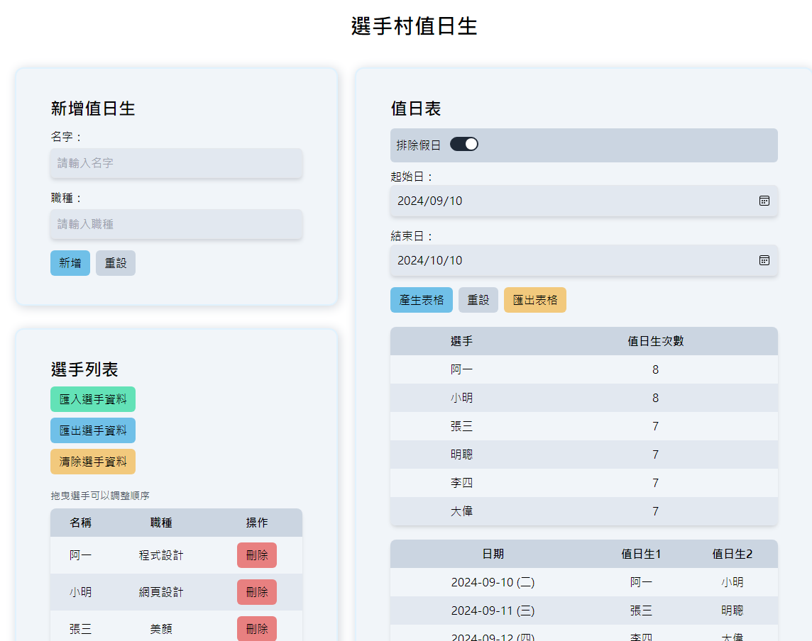

# 值日生自動排班系統

## 簡介

這個網站是個值日生自動排班系統, 用來快速建立值日生排班資料庫, 也可以用來自動排班值日生。

## 功能
- 排班
  - [x] 自動排班值日生
  - [x] 匯出Excel排班資料
  - [x] 排除假日功能
- 選手
  - [x] 建立值日生排班資料庫
  - [x] 刪除選手
  - [x] 匯入/出json選手資料
  - [x] 拖拉選手位置
- 其它
  - [ ] 變成app

## Language & Framework

